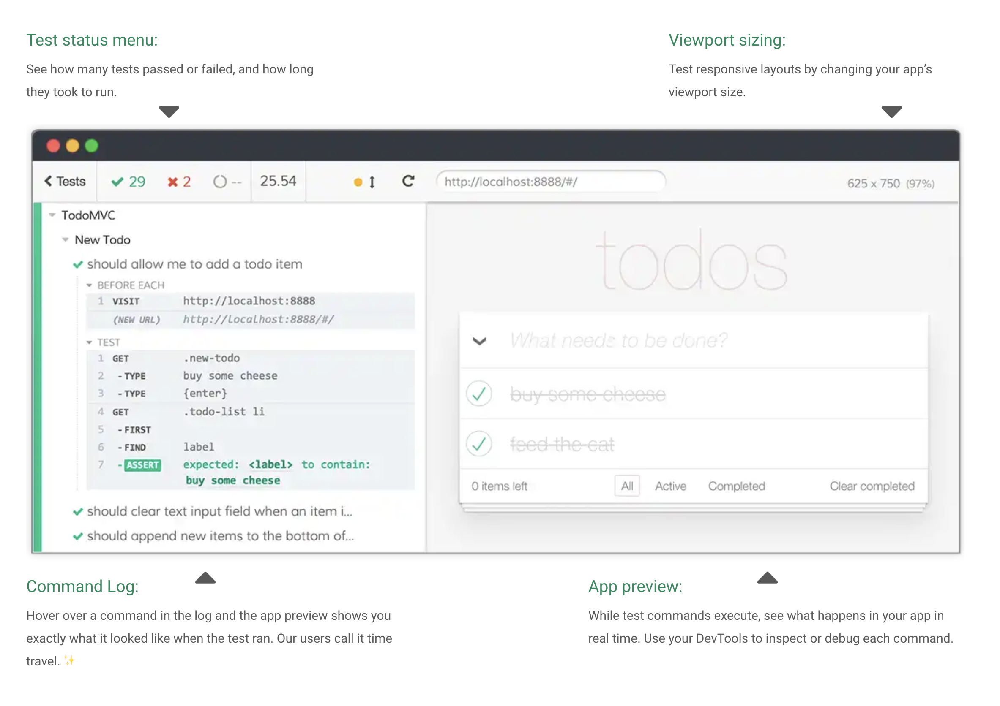

[Cypress](https://www.cypress.io/) is a new, hip, tool for writing and running end to end tests. How well does it play with complex websites?

I have by now written quite a few tests, mostly in JS, some in Ruby, some in PHP. And the tests that have been the most enjoyable to write (with a few exceptions) have been the ones written with Cypress. This is an overview of my experience with the test framework.

  https://www.cypress.io/

If you've ever worked on a large web application you know that changes can be scary. This is because when you try and change something, that change could break some other part of the application without you knowing. 

That is, unless you have *“app”-nipotence* and know about all the things taking place in your codebase at all times. 

This is why high level tests are so crucial for software development. If you have good, reliable tests that you and your team trust then you can deploy changes quicker and with confidence. 

My first foray into the world of user acceptance testing was when I started out in my first proper developer role and got assigned my first task.

The project was to replace their old Selenium test suite with tests written with the newly released Cypress. Selenium is older and more battle-hardened, but it is written in Java and is a pain to maintain if you are a dev team specialising in JS/TS/Ruby. And Cypress is written in JS, and is (was?) new and shiny.

I set out to replace the old test suite, but first I needed to read up on how Cypress works and how to use it to write tests. I dug through the docs and then once I felt comfortable I tried writing my first couple of tests. 

These were fairly basic happy path tests which tried to answer the question: *"Is this feature of our application still working?"*. The main things to test in the case of an e-commerce site like the one I was working on was user authentication like login and create account, completing a purchase, adding items to bags and general navigation around the website.

I quickly realised that there were a lot of things I did not know about the web application since I was getting a lot of unexpected behaviour. Authentication attempts failed, elements were not clickable and other random behaviour.

The tests worked reliably when running in my development environment, but when in the testing environment it would fail. (It works on my machine)

  https://www.reddit.com/r/ProgrammerHumor

This was, as I'm sure you can imagine, quite frustrating. Luckily, Cypress provides video capture of all the tests running which can be used to get a better feel for how The tests were failing.

The web application I was working on was very complex. There were many different smaller applications working together to produce the final output. Components interacted using all kinds of mediums: HTTP requests, the postMessage API, web storage, url parameters & hashes, embedded JS objects and cookies just to name a few.

You could maybe call it a microfrontend setup, a very basic one, where we had a e-commerce framework responsible for routing and content management combined with a number of independently hosted applications that were embedded into the HTML responses using iframes.

Iframes are cool, and they can be very useful in a lot of different contexts. **That doesn't mean you should use them everywhere however.**

<iframe width="100%" height="350" src="https://www.youtube.com/embed/t2ByLmLnYJ8" frameborder="0" allow="accelerometer; encrypted-media; gyroscope; picture-in-picture" allowfullscreen></iframe>

*This video above is embedded using an iframe* 😄

You can think of them as 'mini-websites' embedded into a top-level website, they have their own `src` and JS context. 

The problem with this is that they do not play well with Cypress. The nice route stubbing and other features that Cypress provides are not usable within the iframe contexts. 

That means that if you have a shopping cart feature on your website that is embedded via iframe, then you can't stub out requests issued from within that context. 

Now if you have multiple of those iframes, there could be a lot of things happening when you run Cypress, that the framework is unable to pick up on.

The intial set of tests that I wrote were at the highest level, an out-of-band process ran against our test environment and navigated around on the website, asserting on behaviour. These tests ran on the same 'layer' as the users that use our website. 

If a feature doesn't work when running these tests, then we can't reasonably expect the feature to work for users either. Unless the tests are flaky and unreliable. 

Our first version of user acceptance tests were just that: flaky and unreliable. Because the test suite was not reliable, the team did not trust the results and this led to manual verification and sometimes even errors in production which could have been caught by a reliable test suite.

We eventually got to the point where we rewrote a lot of the tests, once I had more experience with the codebase. The second time around we decided that to get more reliable tests we should build the test from the ground up: write reliable tests for the applications in isolation and then write a few high level integration tests that confirm that things are working together. 

**Does that sound familiar?** That's because it is just like unit and integration tests that developers write every day to test lower level components. 

We write *'unit acceptance tests'* where certain requests are stubbed out to test the individual applications at the highest level. Then we write a few 'integration acceptance tests' which confirm that these distinct units and their integration points are working as expected. 

This approach led to a much more reliable and fast running test suite. Instead of running acceptance tests only on the whole website, we run them as part of the build pipeline for the different parts first. 

To conclude, we write tests to make changes with confidence. But there is a **balance** that one must find when it comes to reliability. 

If you stub out too much of your system then your test is less and less reliable; if you run the test against a production-like site and the test passes, you can be fairly confident that things are working, but the test could get unexpected errors unless you have perfect control over your environment. 

