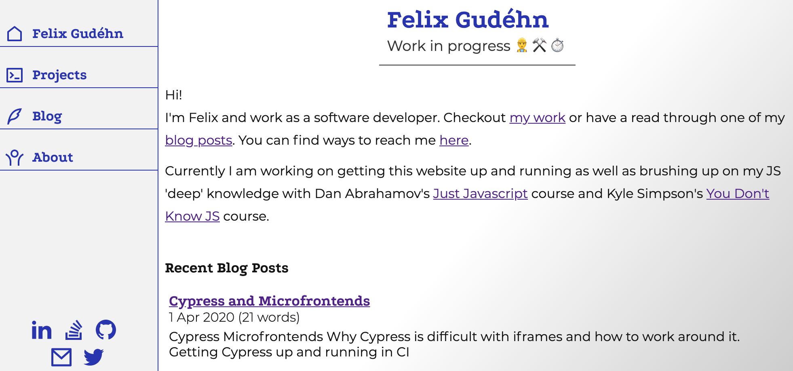
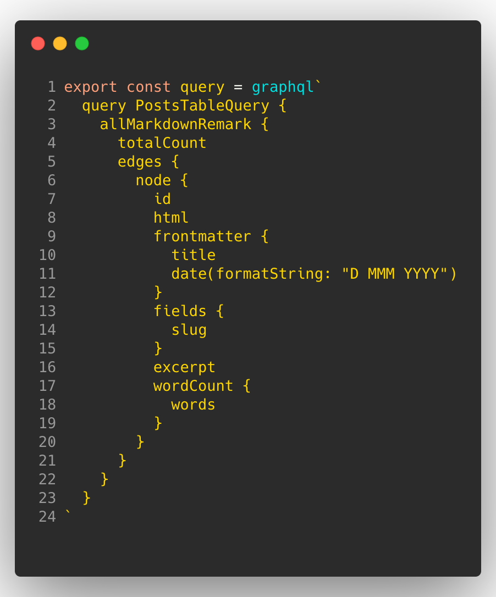
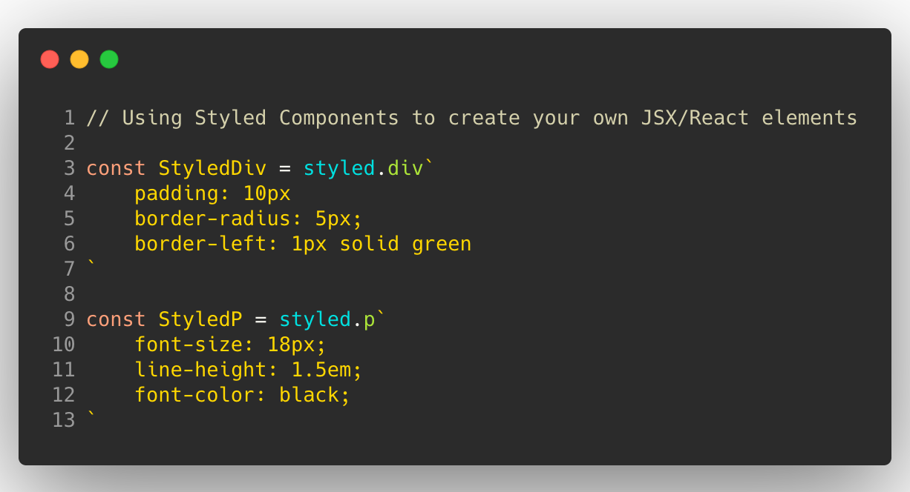
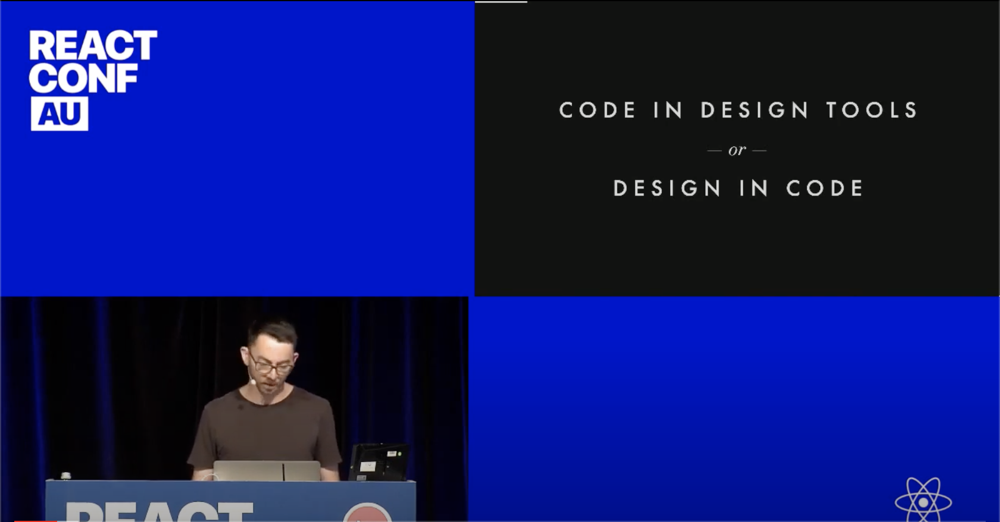
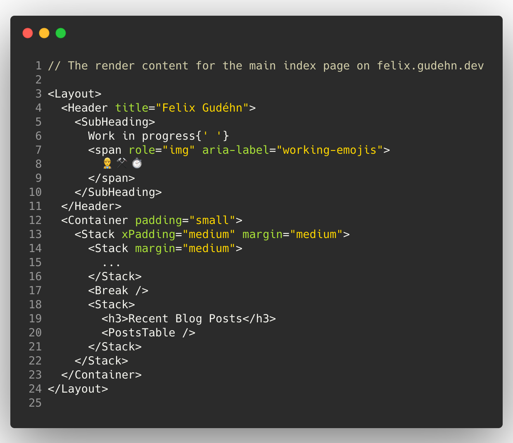

I just finished building my new website! You’re on it already ([`felix.gudehn.dev`](https://felix.gudehn.dev)).

Every developer these days seems to have their own personal website up and running, and I did not want to be the only one without. 

This post will go through some of the details of how I got everything up and running, what tools I used and of course the issues I ran into.

https://felix.gudehn.dev

Building a new website from scratch is always the perfect opportunity to try out some new tools and libraries. First of all I needed to decide if I wanted to roll with a framework or roll my own. I settled on [Gatsby](https://www.gatsbyjs.org/)

Gatsby can be used to build many things, but it works well for content focused websites and apps. So in other words, it is perfect for blogs or personal websites. 

Gatsby is a free and open source framework based on React that helps developers build blazing fast websites and apps - https://www.gatsbyjs.org/

I have dabbled with Gatsby before but never had the time to properly learn how it works. So I quickly went through their [excellent tutorial](https://www.gatsbyjs.org/tutorial/) to get the project off the ground.

The framework is built with a core data layer which a user can fetch data from using the hyper-modern query language [GraphQL](https://graphql.org/learn/).

So the basic gist of it is: Setup the main `Layout` of your website, defined components and page templates and then use GraphQL to query for data like 'all blog posts' or 'the 5 most recent articles' which can then be handled by your React component based pages.

Once I got Gatsby setup to my liking I pretty soon started to think about how to start styling my website. 

There are several ways of styling in Gatsby. You can use plain old CSS files, util first CSS frameworks like [TailwindCSS](https://tailwindcss.com/) and CSS-in-JS libraries like [Emotion](https://emotion.sh/docs/introduction) & [Styled Components](https://styled-components.com/). I settled for Styled Components and used the gatsby plugin [`gatsby-plugin-styled-components`](https://www.gatsbyjs.org/packages/gatsby-plugin-styled-components/) to get it working within Gatsby.

CSS-in-JS libraries provide a way of tying the sack on the ‘modern component’. This was first started by JSX which merged JS & HTML and now CSS-in-JS libraries go even further and put JS, HTML & CSS all in the same file. It’s all in the same place!

https://skywell.software/

Styled Components is a component-driven way of organising all crucial parts of a 'thing' on a website. The Styled Components library is pretty powerful, it allows you to create simple *styled* html components like a styled `
` or a styled `
` with ease.

Now armed with a solid structure for the site with Gatsby and an idea of how to style the components the only thing left to do is to build the actual components! According to me at least, the most fun part of building things with React.

I've been learning a lot about design systems lately so I decided to apply some of the concepts mentioned by Mark Dalgleish in this talk about Design Practices at ReactConfAU 2020. 

In [this talk](https://www.youtube.com/watch?v=xxbc3wAztl0) Mark talks about designating the different tasks of design onto different classes of components. Margin & orientation for Layout components & styling etc to other components.

I decided to use a bit of this thinking by implementing a `<Stack>` and a `<Row>` component. These components have the sole responsibility of positioning children vertically and horizontally. 

This sort of pattern is very useful since you can quickly change / prototype your design by alternating through a set of predefined spacing or size values.

Finally, with my website built with posts, styling & components the last step is now to release it. 

The modern way of releasing a static website is by using a service like [Netlify](https://www.netlify.com/ ) or [Vercel (formerly Zeit)](https://vercel.com/). I've used Netlify previously so I decided to roll with Vercel for comparison.

It is unbelivably easy to get off the ground. Simply connect Zeit to where you are hosting your repository (I'm using GitHub) and press deploy. Easy as. 

The only configuration needed was to redirect my custom domain [managed by Google](https://domains.google.com/) to Zeit, set up some redirects for the `www.*` and apex domain `gudehn.dev` and then the site was live. 

So in conclusion, setting up a personal website in 2020 is a fairly straightforward process using the tools described in the article. Here is a summary of all the ones I mentioned

- Programming Language: JS
- Frameworks: React, Gatsby
- Styling: Styled Component
- Hosting: Vercel

I will keep updating this website with more features so maybe this article will be the first in a series of articles. 😀

That's all for now, and if you liked this blog post or have any questions feel free to reach out.

