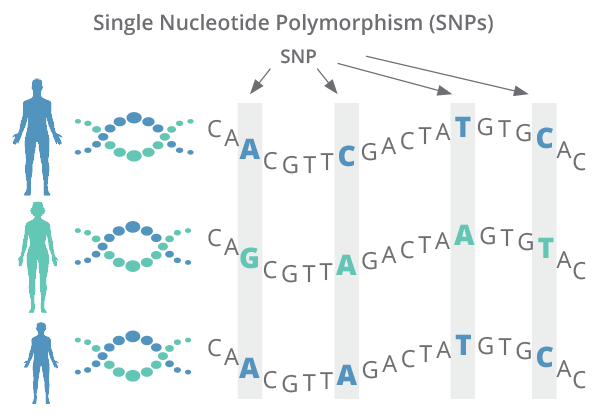
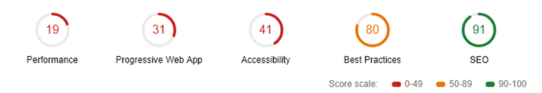

I worked as a Research Assistant at the University of Technology Sydney for almost a year.

When I look back at that time now I am glad that I took that opportunity since some of the skills have been applicable in the work I do day to day as a web developer.

This post is a short reflection on my time at both jobs and an attempt to try and pin down the transferable skills, which I think helped me become a better developer.

http://www.andyroberts.com.au/  
_UTS Building 11, the cheese grater, where I worked as a research assistant in 2018._

### Research Assisting

I had done a capstone project over the summer of my last year at university. My supervising professor liked the work and offered me to stay on for a while and work on a project he was leading. 

The project is called a capstone because it is the final piece (“stone”) of a bachelor student's degree. It is the equivalent of a thesis project in other countries. 

I immediately accepted the offer since I was working in retail at that time and was getting very tired of putting clothes on hangers.

The project consisted of experimentation and modelling of a genomic dataset taken from roughly 200 children and young adults around the New South Wales area that had contracted Acute Lymphoblastic Leukemia (ALL). ALL is an awful disease and it is important that treatment is administered as early as possible. 

https://www.diagnosticsolutionslab.com  
_One of the datasets I was working on was an evaluation of the patients SNP’s, essentially gene mutations that as a whole are a pretty unique DNA fingerprint for an individual. SNPs (pronounced as ‘snips’) can often be linked to how the body responds to treatments and whether someone is subsceptible to certain kinds of diseases._

One of the more important things a medical professional needs to consider is how severe the individual case is. The interpreted severity will decide the strength of the treatment. As I am sure you can imagine, it is important to estimate this severity correctly.

Since I had no background in biology or genomics I had to quickly get familiar with those areas. Then I had to read up on the contemporary research being done and from that figure out what experiments to run using the dataset.

### Unexpected Benefits

Eventually I decided to move on to a different role, working with software development rather than research. The experience I gained in the researcher role did not immediately prove to be any major benefits since there were a lot of basics that I had to learn first.

Although, being comfortable reading and processing a lot of material quickly did help me when reading up on all the new programming languages, libraries and API’s.

Once I started working on my first few projects I did get positive feedback on my approach to some of the work.

One example was the website performance project that my team worked on a few months into the role. Our website had a lot of legacy (old) parts that made the whole experience of using the website slow. 

We were tasked with improving the speed, which meant reducing the time to load, number of resources and removing any redundancies that we thought might help us wittle down those website performance metrics.

I decided to start this project by clearly defining the metrics we were trying to improve and establishing a framework for recording the results and measuring improvements. 

_The (dreaded) website performance metrics generated by Lighthouse. We used this tool and others, to help us measure the performance of the website. The numbers are random and not the actual numbers we obtained._

When you are trying to improve somthing like speed which affects all parts of your system it is often hard to keep track of what changes **actually** helped and what changes just lead to placebo effects.

Since this project had a lot of overlap with the experimental research I did at the university. Some of those lessons I learnt came in handy and allowed me to move faster when doing this very different project.

Another example where the researcher skills were useful is when we worked on improving a very slow, daily reporting job that we ran to track all the things happening in our systems. This reporting job was responsible for processing all the data on daily sales, inventory & operation statistics and even user interactions.

Since this system was home-grown and built incrementally as needed, it was in dire need of a redesign. It took more than 10 hours to run, would occasionally fail and it was only getting slower the more the company grew.

This led to all kinds of problems where the marketing and growth teams were forced to work with stale data and management could not trust that they had full insight into the state of the business.

So me and my team worked on improving this reporting application to get the runtime down to manageable levels. Here the systematic approach worked really well once again. 

Armed with a trusty spreadsheet we began to break down the problem in order to figure out why things were taking so long. 

After a lot of trial and error we managed to track the problem down to a few main issues related to the SQL tables and the queries we had running on them. 

Some tables were missing indexes, which was an easy fix. Some queries did not use the proper columns and were rewritten to run faster using indexes columns and reducing the number of tables involved in the case of redundancies. 

One of the main bugs we found was that indexes were not working, even though we could clearly see them defined in the database. We realised that because we were collecting data from a lot of sources, some of the tables had the wrong character encodings, which in SQL leads to indexes not working at all. 

By the end of that project we managed to get the reporting job processing down to roughly 40 minutes. A **huge** improvement. I like to think that working as a research assistant helped me make that happen quicker, since I was used to running systematic experiments where results are often not immediately obvious and you need to keep trying new approaches to the same problem.

### Conclusion
Doing research was not easy, I struggled in the beginning. But the experience did help me later on since there are a lot of similarities between the role I had at UTS and the work I now do day to day. 

I am happy that I had the opportunity to work in academia, and while I do not think I will be working in that field in the future, it is interesting that there are a lot of transferable skills that helped me in my new role.

So if you are a research assistant thinking about moving into the professional developer industry I think you should give it a shot. There might be more similarities than you think!

